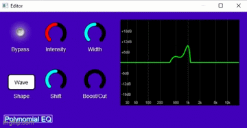

# Polynomial Equalizer

A VST3 Plugin created for the course *NPRG045: Individual Software Project* at Charles University

The goal of this project is to create a working VST3 plugin that can be used in any DAW (Digital Audio Workstation) with some non-trivial functionality.

This plugin will later be forked and used to create a more advanced VST plugin that experiments with various audio processing technology.

## Usage demonstration

    

## Features

- An interactive equalizer giving you control over the entire frequency range
- Live EQ curve visualization
- Many shape presents to choose from.
- Real-time audio processing.

## System Requirements

- **Windows**: 64-bit Windows 10 or later  
- **macOS**: Apple Silicon (ARM64) macOS 11 or later  
- 64-bit DAW with VST3 support

## Installing the plugin

If you are interested in running and using the plugin for yourself, visit [this page](docs/build_guide.md) for a detailed step-by-step guide on how to get you started.

## Further reading

- [Brief user guide](docs/user_guide.md)
- [Full project documentation](https://darilin98.github.io/vst-plugin/index.html)
