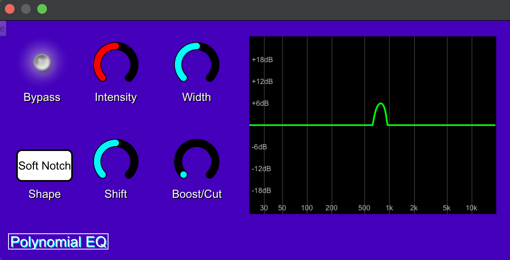

# User Guide

The plugin itself is designed to be very simple and intuitive.

Once you load it to your DAW (see [the build guide](build_guide.md)), you will be presented with this interface.

    

## Parameter description

### Bypass

Turns the EQ on/off. A red flash indicates the plugin not being applied.

### Intensity

Allows for "raising" of the curve. Changes the perceived significance of the modulation.

### Width

Controls how big of a range of frequencies gets modified.

### Shape

Presents a set of presets for shapes which all react to parameters differently.

### Shift

Moves the whole curve to a different range of frequencies.

### Boost/Cut

Allows to flip to lowering the volume of some frequencies instead of boosting them.